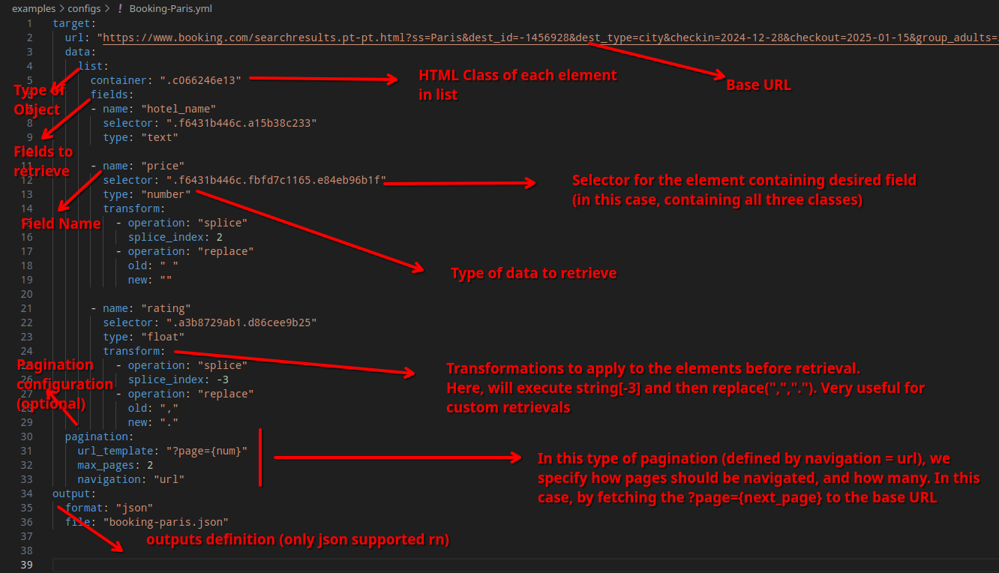

# Sucateiro

Sucateiro is a Python-based web scrapping tool that extracts data from web pages based on configuration YAMLs. Sucateiro provides an uniform configuration appliable to multiple web pages, handling pagination and dynamic placeholders in URLs.

You define what you want to extract from a web page's layout in a config file and Sucateiro extracts it!

Work In Progress.

Please be mindful of websites' terms of services before scrapping them.

Also, this tool is constrained by the general limitations of web scrapping, such as CAPTCHAs and IP blocking. Integration with CAPTCHA solvers and use of Proxies are possible alternatives but I'm not considering implementing them atm. Right now this is a best-effort solution.

## How it works


## Usage

The ```examples/``` folder contains some YAML configuration examples and their respective outputs.

For example, running:

```
$ python3 sucateiro.py examples/configs/ITJobs-DevOps.yml
```

Dumps as JSON ITJob's first 5 pages of job posts for DevOps (file ```examples/outputs/itjobs-devops.json```).


And

```
$ python3 sucateiro.py examples/configs/OLX-Iphone.yml
```

Dumps OLX's search results for Iphones on sale (```examples/outputs/olx-iphone.json```).


The scrapping is done with the same python code, defined by the configuration files.

## Config file explained



Real documentation coming soon, I promise


## TODO

- Support for AJAX Pagination (infinite scrolling)
- Support for defining lambda functions in the configuration files for custom item retrievals
- CSS and By Attribute Selectors
- General Documentation (specially Configuration Files)
- Use Async libs for faster processing
- Implement more outputs formats
